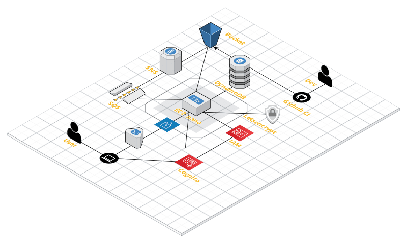

[](https://opensource.org/licenses/Apache-2.0)

# Let's go to ...

This (almost) purely educational application manages places I'd like to visit some day. Key technologies: Angular 8 based single-page app with Mapbox GL, AWS Cognito, S3, DynamoDB for persistence and Spring Boot backend written in Kotlin, all created on AWS Infrastructure with Terraform.

## Infrastructure

You should have [AWS CLI](http://docs.aws.amazon.com/cli/latest/userguide/installing.html) and most importantly [Terraform](https://www.terraform.io/intro/getting-started/install.html) installed.
In a nutshell the application's neighborhood looks as follows (credits to [cloudcraft.co](https://cloudcraft.co/) for their nice web based drawing tool):



## Development

This application was initially generated using [KHipster](https://github.com/jhipster/jhipster-kotlin), you can also find documentation and help at [https://www.jhipster.tech/documentation-archive/v6.4.1](https://www.jhipster.tech/documentation-archive/v6.4.1).

Before you can build this project, you must install and configure the following dependencies on your machine:

1. [Node.js][]: We use Node to run a development web server and build the project.
   Depending on your system, you can install Node either from source or as a pre-packaged bundle.

After installing Node, you should be able to run the following command to install development tools.
You will only need to run this command when dependencies change in [package.json](package.json).

    npm install

We use npm scripts and [Webpack][] as our build system.

Run the following commands in two separate terminals to create a blissful development experience where your browser
auto-refreshes when files change on your hard drive.

    ./gradlew
    npm start

Npm is also used to manage CSS and JavaScript dependencies used in this application. You can upgrade dependencies by
specifying a newer version in [package.json](package.json). You can also run `npm update` and `npm install` to manage dependencies.
Add the `help` flag on any command to see how you can use it. For example, `npm help update`.

The `npm run` command will list all of the scripts available to run for this project.

## OAuth 2.0 / OpenID Connect (todo: update for Cognito)

Congratulations! You've selected an excellent way to secure your JHipster application. If you're not sure what OAuth and OpenID Connect (OIDC) are, please see [What the Heck is OAuth?](https://developer.okta.com/blog/2017/06/21/what-the-heck-is-oauth)

To log in to your app, you'll need to have [Keycloak](https://keycloak.org) up and running. The JHipster Team has created a Docker container for you that has the default users and roles. Start Keycloak using the following command.

```
docker-compose -f src/main/docker/keycloak.yml up
```

The security settings in `src/main/resources/application.yml` are configured for this image.

```yaml
spring:
  ...
  security:
    oauth2:
      client:
        provider:
          oidc:
            issuer-uri: http://localhost:9080/auth/realms/jhipster
        registration:
          oidc:
            client-id: web_app
            client-secret: web_app
```

### Managing dependencies

For example, to add [Leaflet][] library as a runtime dependency of your application, you would run following command:

    npm install --save --save-exact leaflet

To benefit from TypeScript type definitions from [DefinitelyTyped][] repository in development, you would run following command:

    npm install --save-dev --save-exact @types/leaflet

Then you would import the JS and CSS files specified in library's installation instructions so that [Webpack][] knows about them:
Edit [src/main/webapp/app/vendor.ts](src/main/webapp/app/vendor.ts) file:

```
import 'leaflet/dist/leaflet.js';
```

Edit [src/main/webapp/content/scss/vendor.scss](src/main/webapp/content/scss/vendor.scss) file:

```
@import '~leaflet/dist/leaflet.css';
```

Note: There are still a few other things remaining to do for Leaflet that we won't detail here.

For further instructions on how to develop with JHipster, have a look at [Using JHipster in development][].

### Using Angular CLI

You can also use [Angular CLI][] to generate some custom client code.

For example, the following command:

    ng generate component my-component

will generate few files:

    create src/main/webapp/app/my-component/my-component.component.html
    create src/main/webapp/app/my-component/my-component.component.ts
    update src/main/webapp/app/app.module.ts

## Building for production

### Packaging as jar

To build the final jar and optimize the letsgo2 application for production, run:

    ./gradlew -Pprod clean bootJar

This will concatenate and minify the client CSS and JavaScript files. It will also modify `index.html` so it references these new files.
To ensure everything worked, run:

    java -jar build/libs/*.jar

Then navigate to [http://localhost:8080](http://localhost:8080) in your browser.

Refer to [Using JHipster in production][] for more details.

### Packaging as war

To package your application as a war in order to deploy it to an application server, run:

    ./gradlew -Pprod -Pwar clean bootWar

## Testing

To launch your application's tests, run:

    ./gradlew test integrationTest jacocoTestReport

### Client tests

Unit tests are run by [Jest][] and written with [Jasmine][]. They're located in [src/test/javascript/](src/test/javascript/) and can be run with:

    npm test

For more information, refer to the [Running tests page][].

### Code quality

Sonar is used to analyse code quality. You can start a local Sonar server (accessible on http://localhost:9001) with:

```
docker-compose -f src/main/docker/sonar.yml up -d
```

You can run a Sonar analysis with using the [sonar-scanner](https://docs.sonarqube.org/display/SCAN/Analyzing+with+SonarQube+Scanner) or by using the gradle plugin.

Then, run a Sonar analysis:

```
./gradlew -Pprod clean check jacocoTestReport sonarqube
```

For more information, refer to the [Code quality page][].

[jhipster homepage and latest documentation]: https://www.jhipster.tech
[jhipster 6.4.1 archive]: https://www.jhipster.tech/documentation-archive/v6.4.1
[using jhipster in development]: https://www.jhipster.tech/documentation-archive/v6.4.1/development/
[using docker and docker-compose]: https://www.jhipster.tech/documentation-archive/v6.4.1/docker-compose
[using jhipster in production]: https://www.jhipster.tech/documentation-archive/v6.4.1/production/
[running tests page]: https://www.jhipster.tech/documentation-archive/v6.4.1/running-tests/
[code quality page]: https://www.jhipster.tech/documentation-archive/v6.4.1/code-quality/
[setting up continuous integration]: https://www.jhipster.tech/documentation-archive/v6.4.1/setting-up-ci/
[node.js]: https://nodejs.org/
[yarn]: https://yarnpkg.org/
[webpack]: https://webpack.github.io/
[angular cli]: https://cli.angular.io/
[browsersync]: https://www.browsersync.io/
[jest]: https://facebook.github.io/jest/
[jasmine]: https://jasmine.github.io/2.0/introduction.html
[protractor]: https://angular.github.io/protractor/
[leaflet]: https://leafletjs.com/
[definitelytyped]: https://definitelytyped.org/

- [dynamdodb support array](https://docs.aws.amazon.com/de_de/amazondynamodb/latest/developerguide/DynamoDBMapper.Annotations.html)
